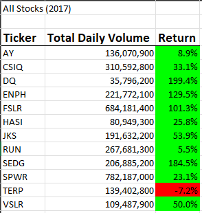
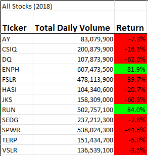
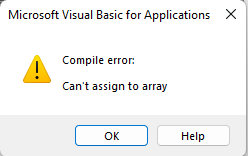
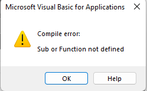
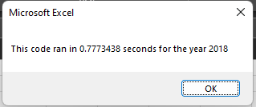
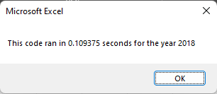

# VBA Challenge
## Stocks Analysis
### Overview of analysis

The purpose of this analysis was to determine how stocks are performing in any given year. I was given a set of data to perform the analysis. It was made to work quickly, and at the click of a button. 

### Analysis and Challenges

#### Analysis

Once the data was formatted to something more legible for the average person to read, it was made available to the rest of Steve's team. As we can see from the "All Stock Analysis" sheet, the rate of return in 2017 was much more successful than 2018. Nearly every stock tracked had a positive return in 2017. 


In 2018 the rate of return drastically changed. Nearly all stocks tracked showed a negative rate of return. There were two stocks however, that showed positive results both years running. Stock ticker "ENPH" and "RUN" showed returns between 81% - 84% in 2018.




#### Challenges

There were many challenges that led to the creation of this formatted sheet. There many error codes when trying to debug the code. Errors such as this:



And this: 




After a lot of work, the code finally worked, but the speed it took to run the VBA could of been better. Here is how fast the code ran with my initial iteration of the vbscript:



After some refactoring, the code looked much nicer, and ran faster! 



### Results

After reviewing the data, we could plainly see that there was a significant decline with most of the stocks evaluated. We could also see the two stocks that held strong, even during a decline year. Our best option to invest would be to choose "ENPH" and "RUN". Choosing either of these two will give us the greatest chance to make a profit based on analyzing the previous years side-by-side.

### Should we refactor?

When the first iteration of this VBA code was written, there were many errors, and lots of duplicate code. There were multiple "Sub procedure's" that made the script run much slower. The script was written very blocky and was not as easily legible if another developer looked at my code. After refactoring the code, everything ran much faster! All of the clunky chunks of code were cleaned up. The entire body of code was more legible to anyone who would need to review it. In summary, the refactored version of the code was the better version, and all codes should be refactored after they have been written, because there is always a way to make it better. Enjoy a copy of the refactored code. 
```
Sub AllStocksAnalysisRefactored()
    Dim startTime As Single
    Dim endTime  As Single

    yearValue = InputBox("What year would you like to run the analysis on?")

    startTime = Timer
    
    'Format the output sheet on All Stocks Analysis worksheet
    Worksheets("All Stock Analysis").Activate
    
    Range("A1").Value = "All Stocks (" + yearValue + ")"
    
    'Create a header row
    Cells(3, 1).Value = "Ticker"
    Cells(3, 2).Value = "Total Daily Volume"
    Cells(3, 3).Value = "Return"

    'Initialize array of all tickers
    Dim tickers(12) As String
    
    tickers(0) = "AY"
    tickers(1) = "CSIQ"
    tickers(2) = "DQ"
    tickers(3) = "ENPH"
    tickers(4) = "FSLR"
    tickers(5) = "HASI"
    tickers(6) = "JKS"
    tickers(7) = "RUN"
    tickers(8) = "SEDG"
    tickers(9) = "SPWR"
    tickers(10) = "TERP"
    tickers(11) = "VSLR"
    
    'Activate data worksheet
    Worksheets(yearValue).Activate
    
    'Get the number of rows to loop over
    RowCount = Cells(Rows.Count, "A").End(xlUp).Row
    
    '1a) Create a ticker Index
    tickerIndex = 0
    

    '1b) Create three output arrays
    'https://learn.microsoft.com/en-us/office/vba/language/concepts/getting-started/using-arrays
    Dim tickerVolumes(12) As Long
    Dim tickerStartingPrices(12) As Single
    Dim tickerEndingPrices(12) As Single
    
    
    ''2a) Create a for loop to initialize the tickerVolumes to zero.
    For i = 0 To 11
    tickerVolumes(i) = 0
    
    Next i
    
        
    ''2b) Loop over all the rows in the spreadsheet.
        For i = 2 To RowCount
    
        '3a) Increase volume for current ticker
            tickerVolumes(tickerIndex) = tickerVolumes(tickerIndex) + Cells(i, 8).Value

            
        
        '3b) Check if the current row is the first row with the selected tickerIndex.
        'If  Then
            If Cells(i, 1).Value = tickers(tickerIndex) And Cells(i - 1, 1).Value <> tickers(tickerIndex) Then
            tickerStartingPrices(tickerIndex) = Cells(i, 6).Value
            
                       
            End If
        
        '3c) check if the current row is the last row with the selected ticker
         'If the next row’s ticker doesn’t match, increase the tickerIndex.
        'If  Then
            If Cells(i, 1).Value = tickers(tickerIndex) And Cells(i + 1, 1).Value <> tickers(tickerIndex) Then
            tickerEndingPrices(tickerIndex) = Cells(i, 6).Value
            
            End If
            
            '3d Increase the tickerIndex.
            If Cells(i + 1, 1).Value <> tickers(tickerIndex) Then
            tickerIndex = tickerIndex + 1
            
            End If
            
        Next i
            

    
    '4) Loop through your arrays to output the Ticker, Total Daily Volume, and Return.
    For i = 0 To 11
        
        Worksheets("All Stock Analysis").Activate
        Cells(4 + i, 1).Value = tickers(i)
        Cells(4 + i, 2).Value = tickerVolumes(i)
        Cells(4 + i, 3).Value = tickerEndingPrices(i) / tickerStartingPrices(i) - 1
        
    Next i
    
    'Formatting
    Worksheets("All Stock Analysis").Activate
    Range("A3:C3").Font.FontStyle = "Bold"
    Range("A3:C3").Borders(xlEdgeBottom).LineStyle = xlContinuous
    Range("B4:B15").NumberFormat = "#,##0"
    Range("C4:C15").NumberFormat = "0.0%"
    Columns("B").AutoFit

    dataRowStart = 4
    dataRowEnd = 15

    For i = dataRowStart To dataRowEnd
        
        If Cells(i, 3) > 0 Then
            
            Cells(i, 3).Interior.Color = vbGreen
            
        Else
        
            Cells(i, 3).Interior.Color = vbRed
            
        End If
        
    Next i
 
    endTime = Timer
    MsgBox "This code ran in " & (endTime - startTime) & " seconds for the year " & (yearValue)

End Sub
```
